# Lueur — AI Companion, Mood Journal & Mindful Play

> Your pocket companion. Talk to Luna, track your moods, breathe, draw, and grow together.

---

## What is Lueur?

Lueur is a Flutter mobile app that pairs an AI mood journal with a small toolkit of calming activities. Users share how they feel through emoji and free-text thoughts, and Luna (an AI companion backed by a Django REST API) responds with empathetic, personalized reflections and supports natural follow-up chat. Beyond journaling, Lueur tracks mood history, visualizes emotional patterns, and gamifies consistency through a plant-growth streak system — and gives users a few grounding activities (guided breathing, free drawing, sudoku) for moments they'd rather not talk.

The app supports English and Arabic (with full RTL layout), light/dark theming, and Firebase-based authentication (email/password + Google Sign-In).

---

## Screenshots

### Onboarding, Auth & Home

<table>
  <tr>
    <td>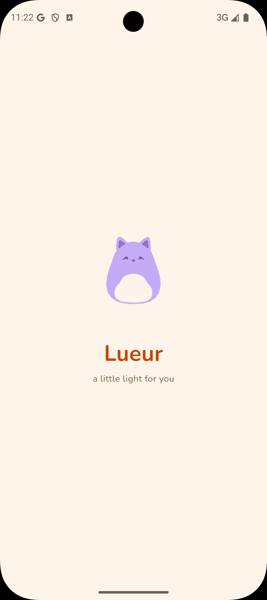</td>
    <td>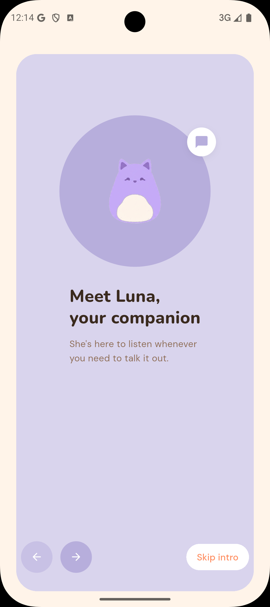</td>
    <td>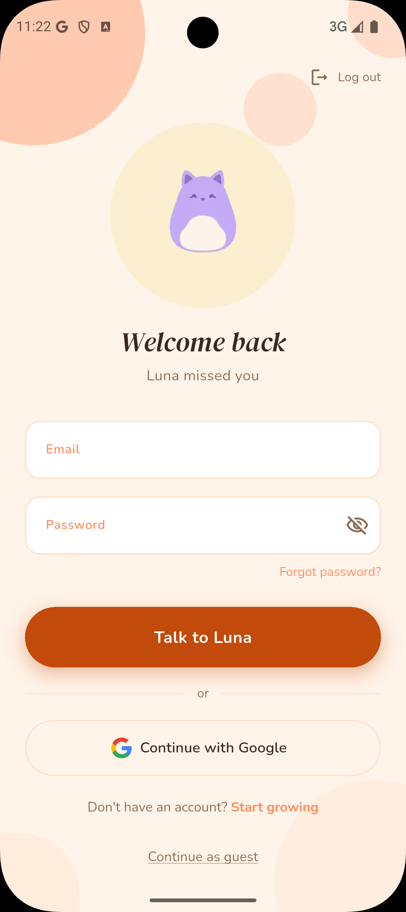</td>
    <td>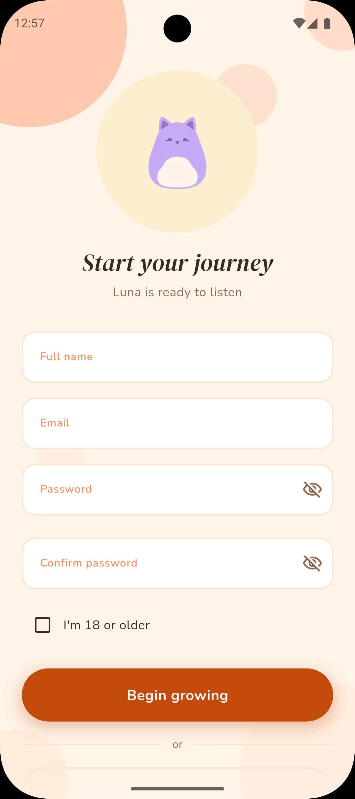</td>
  </tr>
  <tr>
    <td>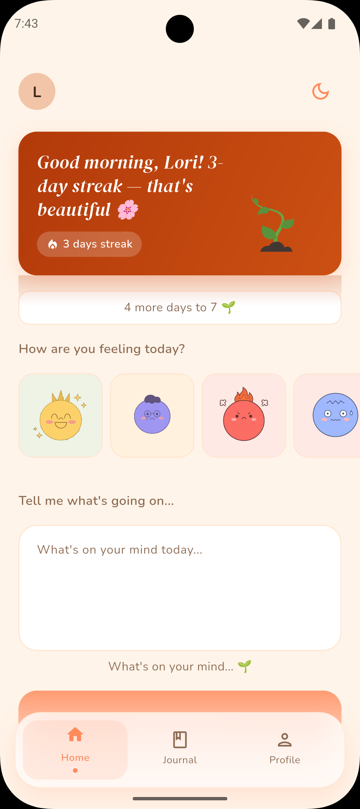</td>
    <td>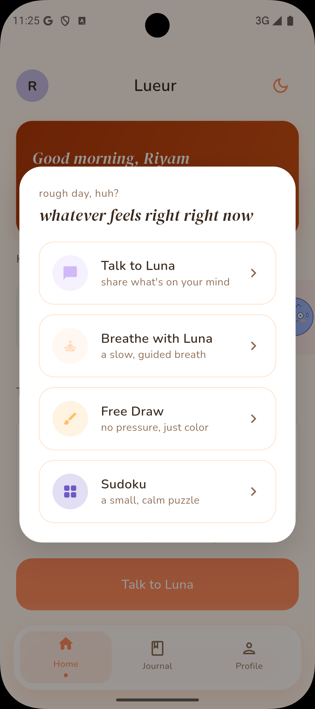</td>
    <td>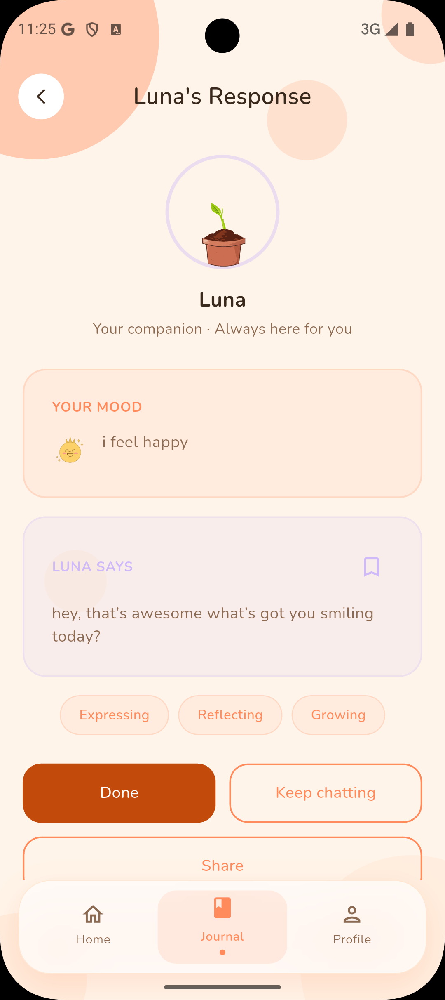</td>
    <td>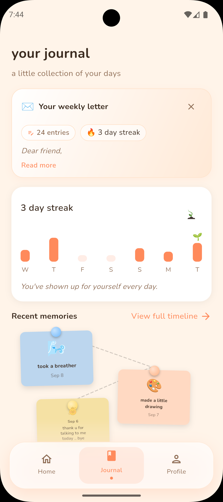</td>
  </tr>
</table>

### Dark Mode & Activities

<table>
  <tr>
    <td>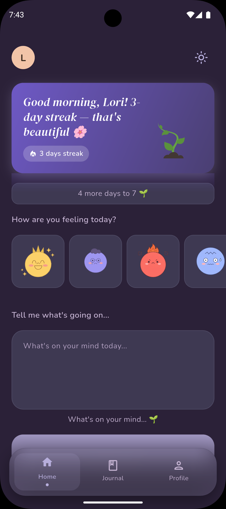</td>
    <td>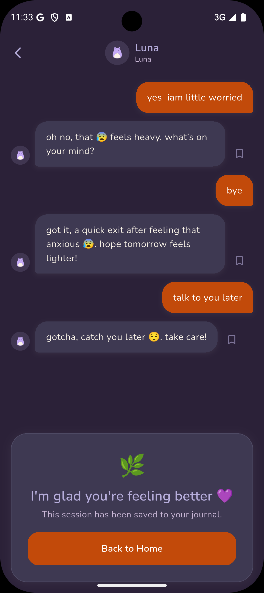</td>
    <td>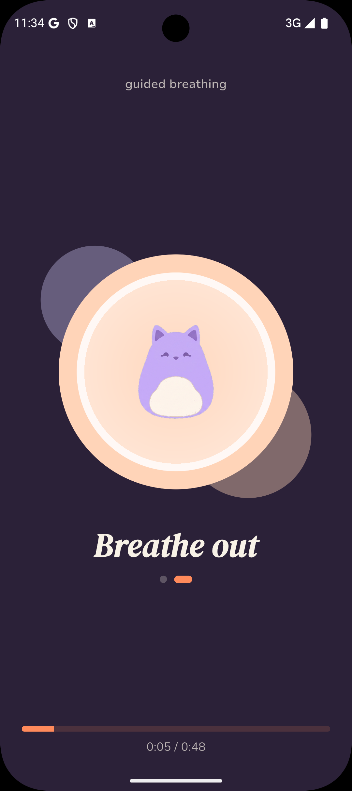</td>
    <td>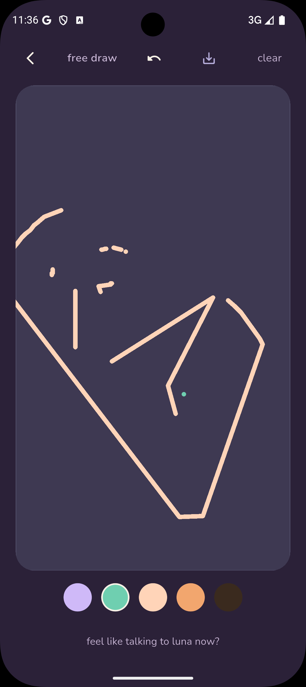</td>
  </tr>
  <tr>
    <td>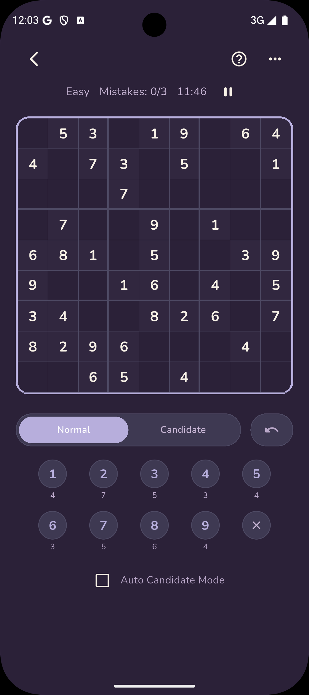</td>
    <td>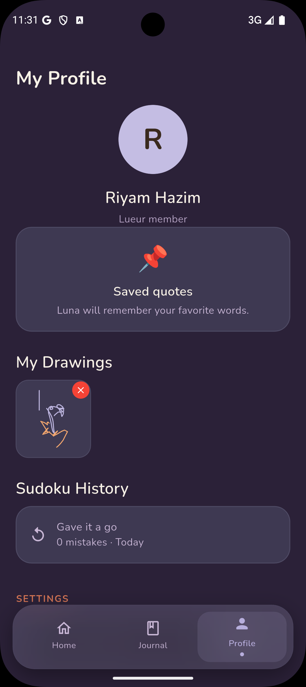</td>
    <td>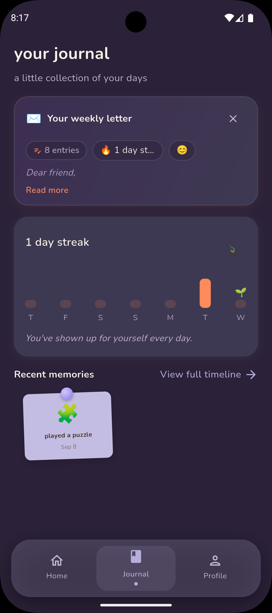</td>
    <td>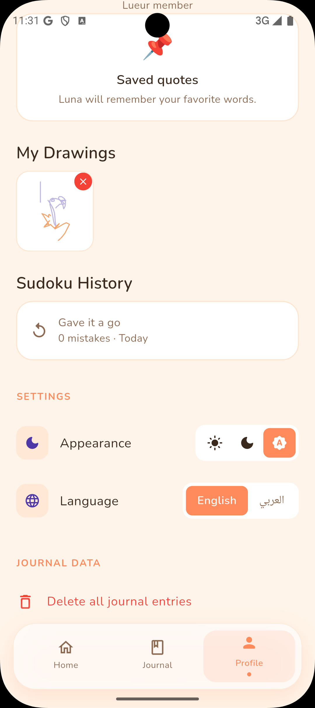</td>
  </tr>
</table>

More screenshots covering every screen (both themes) live in [`screenshots/`](screenshots/).

---

## Features

| Feature | Description |
| --- | --- |
| AI Mood Response | Share an emoji + thoughts → Luna responds with an empathetic, personalized reflection |
| Follow-up Chat | Continue the conversation with Luna after the initial response |
| Mood Journal | Grid/history view of all entries with emoji filter, search, pin, and card color |
| Streak & Plant | Daily journaling grows a virtual plant (seed → sprout → blooming), with a streak celebration screen |
| Weekly Letter | AI-generated weekly emotional reflection with stats |
| Saved Quotes | Bookmark Luna's responses for later, view and delete them |
| Breathing Exercise | Guided 4-7-8 breathing technique with animated visuals |
| Affirmations | Emoji-specific rotating affirmation cards |
| Free Drawing | Open canvas for expressive/calming drawing, with a gallery of saved drawings |
| Sudoku | Playable sudoku puzzles with move validation and saved results history |
| Mood Choice Dialog | Lightweight prompt offering an activity (breathe, draw, play) based on the selected mood |
| Auth | Email/password and Google Sign-In via Firebase Auth, plus forgot-password flow |
| Dark / Light Theme | User-selectable, persisted locally, applied instantly across the app |
| Localization | English and Arabic, including RTL layout, via `AppLocalizations` (Flutter `intl`/l10n) |
| Analytics & Crash Reporting | Firebase Analytics + Sentry (with a privacy filter that scrubs sensitive data before sending) |
| Onboarding | First-launch walkthrough introducing Luna and the app's core loop |

---

## Tech Stack

| Layer | Technology |
| --- | --- |
| Framework | Flutter (Dart) |
| State Management | flutter_bloc (Cubit) |
| Navigation | go_router |
| Auth | Firebase Auth (email/password + Google Sign-In via `google_sign_in`) |
| Backend | Django REST Framework, deployed on Railway |
| Local Storage | Hive (mood entries, saved quotes, sudoku results, saved drawings) + `shared_preferences` (theme, language) |
| Networking | Dio + PrettyDioLogger |
| DI | GetIt |
| Error Handling | dartz (`Either<Failure, T>`) |
| Code Generation | json_serializable, hive_generator, build_runner |
| Responsive UI | flutter_screenutil |
| Localization | flutter_localizations + `intl` (ARB-based, `lib/l10n/`) |
| Charts | fl_chart |
| Analytics / Crash Reporting | firebase_analytics, sentry_flutter, sentry_dio |
| Misc | confetti (streak celebration), lottie (animations), screenshot + share_plus (sharing saved content) |

---

## Architecture

Clean Architecture with strict layer separation:

```text
Presentation  (Screens, Widgets, Cubits)
     ↓
Domain        (Entities, Repository interfaces, Use Cases)
     ↓
Data          (Models, Repository impls, DataSources)
     ↓
External      (Django API, Firebase, Hive, SharedPreferences, Dio)
```

Dependencies point downward only — presentation never talks to data directly, and the domain layer has zero Flutter imports.

### Feature Structure

```text
lib/
├── core/
│   ├── constants/         — AppSizes, AppSpacing
│   ├── errors/            — Failure classes (NetworkFailure, ServerFailure, ...)
│   ├── injection/         — single setupInjection() — all GetIt registrations
│   ├── models/            — shared UI models (e.g. MoodEntry)
│   ├── monitoring/        — Sentry privacy filter (scrubs PII before reporting)
│   ├── navigation/        — shell screen, bottom nav bar
│   ├── networking/        — DioHelper, ApiEndpoints, AuthTokenInterceptor
│   ├── preferences/       — OnboardingPrefs (Hive-backed "has seen onboarding" flag)
│   ├── routing/           — GoRouter config (router_generation_config.dart, app_routes.dart)
│   ├── styling/           — AppTheme, AppColors, AppExtraColors, text styles, fonts
│   ├── theme/             — theme-related core widgets/helpers
│   ├── utils/             — shared helpers/extensions
│   └── widgets/           — shared reusable widgets
│
├── features/
│   ├── affirmation/       — emoji-specific affirmation cards
│   ├── auth/               — login, register, forgot password, Firebase + Django auth
│   ├── breathing/          — guided 4-7-8 breathing exercise
│   ├── chat/                — follow-up chat with Luna
│   ├── draw/                — free drawing canvas + saved drawings gallery
│   ├── home/                — mood input, AI response trigger, history, weekly letter
│   ├── journal/             — searchable/filterable mood history grid
│   ├── language/            — language preference (Cubit, local datasource, sync usecase)
│   ├── mood_choice/         — post-mood-selection activity dialog (presentation-only)
│   ├── onboarding/          — first-launch walkthrough (presentation-only)
│   ├── plant/                — streak calculation, plant growth visualization, celebration screen
│   ├── profile/              — user stats, settings entry point, logout
│   ├── quotes/                — save, browse, and delete Luna's saved responses
│   ├── response/               — AI-generated response screen + save-quote action
│   ├── splash/                  — entry point, decides auth/onboarding redirect
│   ├── sudoku/                   — sudoku puzzle generation, play, and saved results
│   └── theme/                     — light/dark theme preference (Cubit, local datasource)
│
├── l10n/                    — ARB files + generated AppLocalizations (en, ar)
├── firebase_options.dart    — generated Firebase config (FlutterFire CLI)
└── main.dart                — Firebase/Hive/DI/Sentry bootstrap, app entry point
```

`onboarding` and `mood_choice` are intentionally presentation-only — no domain/data layers exist for them since they hold no business logic of their own.

---

## Backend API

Base URL: `https://web-production-f8628.up.railway.app`

| Method | Endpoint | Description |
| --- | --- | --- |
| POST | `/api/auth/verify/` | Verify a Firebase ID token with the backend |
| GET | `/api/accounts/me/` | Fetch the current user's account/profile info |
| POST | `/api/companion/generate/` | Generate an AI response for an emoji + thoughts entry |
| GET | `/api/companion/history/` | Fetch the current user's mood history |
| GET | `/api/companion/weekly-letter/` | Get the AI-generated weekly reflection |

Requests are authenticated with a Firebase ID token attached by `AuthTokenInterceptor` (`core/networking/`).

---

## Setup

### Prerequisites

- Flutter SDK (Dart ≥ 3.0.0)
- Android Studio / Xcode
- A Firebase project (Auth + Analytics enabled) with `google-services.json` / `GoogleService-Info.plist` configured
- FlutterFire CLI to (re)generate `lib/firebase_options.dart` if setting up a new Firebase project
- Access to the deployed Django backend (or a local instance)

### Install & Run

```bash
# Install dependencies
flutter pub get

# Generate code (Hive adapters + JSON serialization)
dart run build_runner build --delete-conflicting-outputs

# Run the app
flutter run

# Run on a specific device
flutter run -d ios
flutter run -d android
```

### Optional runtime configuration

Sentry crash reporting and the environment label are supplied at build/run time via `--dart-define` (never hardcoded):

```bash
flutter run --dart-define=SENTRY_DSN=your-dsn --dart-define=APP_ENV=development
```

If `SENTRY_DSN` is omitted, Sentry simply stays inactive — the app runs normally.

### Build for Release

```bash
flutter build apk --release
flutter build ios --release
```

### Tests & Lint

```bash
flutter test
flutter analyze
```

---

## Design System

### Colors

| Role | Light | Dark |
| --- | --- | --- |
| Primary | Peach `#E8621A` | Purple `#7C5CDB` |
| Background | Cream `#FFF8F5` | Deep `#16132A` |
| Surface | `#FFF0E8` | `#1E1A35` |
| Text Primary | Dark brown `#2D2016` | Light purple `#EDE9FE` |
| Secondary text | `#7A5038` | `#6B6490` |

Extra semantic colors (mood colours, surface variants) live in `AppExtraColors`, a `ThemeExtension` accessed via `Theme.of(context).extension<AppExtraColors>()`.

### Typography

Two text style systems coexist by design:

| Class | Scaling | Used by |
| --- | --- | --- |
| `AppTextStyles` | Custom `_scale()` clamp based on screen width | Newer screens (splash, onboarding, auth) |
| `ThemeTextStyles` | `flutter_screenutil` (`.sp`) | Older feature screens (home, journal, etc.) |

Fonts: **Nunito** (primary body/UI) and **DMSerifDisplay** (display/italic headings), both bundled; **DM Sans** also loaded via Google Fonts at startup.

### Spacing Grid

8px base — use `AppSizes` / `AppSpacing` constants and `flutter_screenutil` (`.r`/`.w`/`.h`), not raw literals.

---

## Key Design Decisions

1. **Cubit over Bloc** — simpler for this app size, no complex event streams needed
2. **Hive over SQLite** — no schema migrations, fast for simple local models (mood entries, quotes, sudoku results, drawings)
3. **GetIt over Provider/Riverpod for DI** — decoupled from the widget tree, easier to test
4. **MoodCubit as a singleton** — shared state across all bottom-nav tabs (home / journal / profile)
5. **Firebase Auth** — handles email/password + Google Sign-In; the Django backend verifies the Firebase ID token
6. **Sealed classes over Freezed** for state unions — native Dart 3 `sealed class` + exhaustive `switch`
7. **Theme & language persisted locally** — no flash on cold start, consistent across logout
8. **Sentry privacy filter** — `beforeSend` hook scrubs sensitive data before any crash report leaves the device

---

## State Management

All state is managed through Cubits. Pattern used throughout:

```dart
// In cubit
emit(Loading());
final result = await repository.doSomething();
result.fold(
  (failure) => emit(Error(failure.message)),
  (data)    => emit(Success(data)),
);

// In UI
BlocBuilder<XCubit, XState>(
  builder: (context, state) => switch (state) {
    XSuccess(:final data)  => DataWidget(data),
    XLoading()             => LoadingWidget(),
    XError(:final message) => ErrorWidget(message),
    _                      => const SizedBox(),
  },
);
```

---

## Developer

**Riyam** — sole developer
