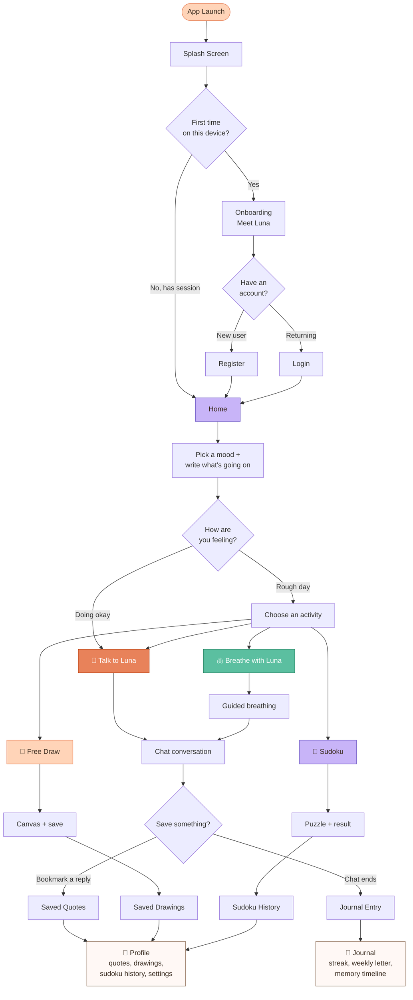

```mermaid
flowchart TD
    A([App Launch]) --> B[Splash Screen]
    B --> C{First time<br/>on this device?}

    C -->|Yes| D[Onboarding<br/>Meet Luna]
    C -->|No, has session| H[Home]

    D --> E{Have an<br/>account?}
    E -->|New user| F[Register]
    E -->|Returning| G[Login]
    F --> H
    G --> H

    H --> I[Pick a mood +<br/>write what's going on]
    I --> J{How are<br/>you feeling?}

    J -->|Rough day| K[Choose an activity]
    J -->|Doing okay| L[Talk to Luna]

    K --> L[💬 Talk to Luna]
    K --> M[🫁 Breathe with Luna]
    K --> N[🎨 Free Draw]
    K --> O[🧩 Sudoku]

    L --> P[Chat conversation]
    P --> Q{Save something?}
    Q -->|Bookmark a reply| R[Saved Quotes]
    Q -->|Chat ends| S[Journal Entry]

    M --> T[Guided breathing]
    T --> P

    N --> U[Canvas + save]
    U --> V[Saved Drawings]

    O --> W[Puzzle + result]
    W --> X[Sudoku History]

    S --> Y[📓 Journal<br/>streak, weekly letter,<br/>memory timeline]
    R --> Z[👤 Profile<br/>quotes, drawings,<br/>sudoku history, settings]
    V --> Z
    X --> Z

    style A fill:#FFD4B8,stroke:#E8825A,color:#3A2A1E
    style H fill:#C8B4F8,stroke:#6E59C5,color:#3A2A1E
    style L fill:#E8825A,stroke:#B23A0A,color:#fff
    style M fill:#5BBFA0,stroke:#2E7D5F,color:#fff
    style N fill:#FFD4B8,stroke:#E8825A,color:#3A2A1E
    style O fill:#C8B4F8,stroke:#6E59C5,color:#3A2A1E
    style Y fill:#FFF8F5,stroke:#8C6A52,color:#3A2A1E
    style Z fill:#FFF8F5,stroke:#8C6A52,color:#3A2A1E
```
