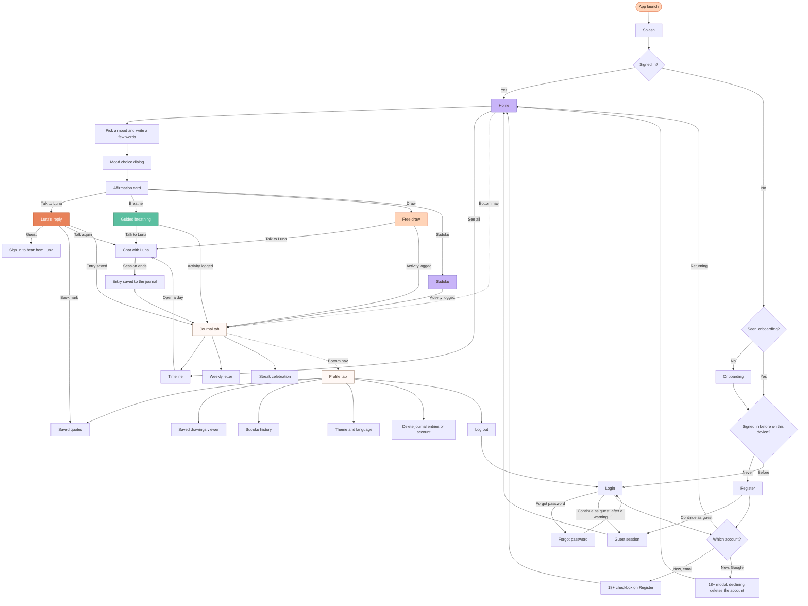

> **Chat ending:** when a chat ends, the backend saves the session as a journal entry and the app shows the "saved to your journal" card. The one exception is a fallback reply (when Luna can't answer): it is never saved, never shows that card, and never reaches the Journal or Saved quotes.
